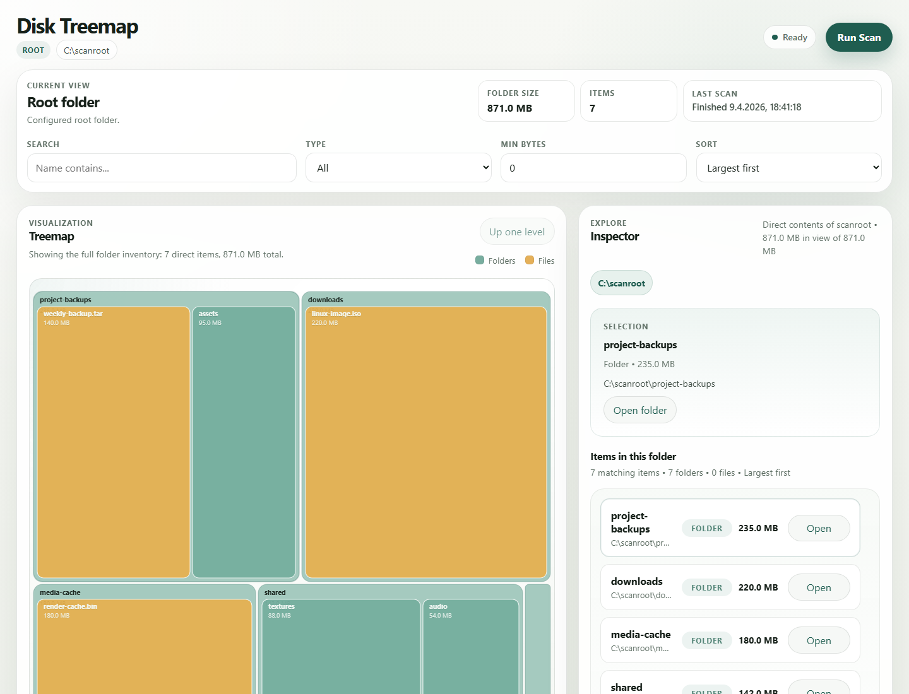

# Disk Treemap

Disk Treemap is a lightweight, self-hosted disk usage explorer for a single directory tree. It gives you a browser-based treemap, folder inspector, and quick filters so you can find large folders and files without digging through a file manager by hand.

Scans run only when you ask for them. The UI stays constrained to one configured root path, which makes it practical for servers, NAS mounts, game servers, media libraries, and other large storage directories.



## Quickstart

### Docker Compose (recommended)

Prerequisites:

- Docker Engine or Docker Desktop
- A folder you want to inspect

1. Open `docker-compose.yaml`.
2. Replace `/host/path/to/analyze` with the folder you want to scan.
3. Start the app:

```bash
docker compose up -d --build
```

4. Open [http://localhost:8080](http://localhost:8080)
5. Click `Run Scan`
6. Click treemap tiles or inspector rows to drill into large folders

Example volume mapping:

- Linux or macOS: `- /srv/storage:/scanroot:ro`
- Windows: `- C:\Data:/scanroot:ro`

The included compose file already persists scan data in a Docker volume named `treemap-data`.

### `docker run`

If you prefer a one-off container:

```bash
docker build -t disk-treemap:latest .

docker run --rm \
  --user 0:0 \
  -p 8080:8080 \
  -e ANALYZE_ROOT=/scanroot \
  -e DATA_DIR=/data \
  -v /host/path/to/analyze:/scanroot:ro \
  -v treemap-data:/data \
  disk-treemap:latest
```

Then open [http://localhost:8080](http://localhost:8080).

## Development checks

Use the Go version declared in `go.mod`. On PowerShell, run the complete local feedback loop with:

```powershell
./scripts/check.ps1
```

The script checks Go formatting, runs `go vet`, and executes the full test suite. It keeps Go caches and telemetry state in ignored workspace directories so the same command also works in restricted development environments.

## What It Does

- Runs on-demand scans instead of continuous background indexing
- Shows the current folder as an interactive treemap
- Lets you drill down with clicks, breadcrumbs, and an inspector panel
- Filters the current view by name, type, minimum size, and sort order
- Keeps browsing limited to one configured root path
- Persists scan data across restarts when `DATA_DIR` is backed by a volume

## First Use

1. Start the container and open the web UI.
2. Click `Run Scan`.
3. Wait for the scan status to change to `Ready`.
4. Click large rectangles to focus items.
5. Open folders from the treemap or the inspector list.
6. Use search or minimum size filters to remove noise.

Notes:

- Only one scan runs at a time.
- Large directory trees may take a while on the first pass.
- The current view shows the direct contents of the selected folder.
- The `In view` metric appears only when filters or result limits hide part of the total size.

## Reading the Interface

- `Root`: The fixed top-level directory exposed by the app
- `Current view`: The folder you are currently exploring
- `Folder size`: The full size of the current folder
- `Items`: The number of direct child items currently represented
- `Last scan`: When the most recent completed scan finished
- `Treemap`: Visual size comparison of the current folder contents
- `Inspector`: The currently selected item plus the folder's direct children

## Typical Use Cases

- Find what is filling a game server save directory
- Inspect media libraries, downloads folders, or backup volumes
- Check which subfolders inside an application data directory are growing
- Explore large mounted folders on a server without installing a full desktop tool

## Recommended Deployment Notes

- Mount the scan root read-only whenever possible
- Use a persistent volume for `DATA_DIR` so scans survive container restarts
- Keep the app behind a reverse proxy or private network if others can reach it
- The container runs as `root` by default so it can read more files; use that deliberately

## Configuration

### Common Settings

| Variable | Required | Default | Purpose |
| --- | --- | --- | --- |
| `ANALYZE_ROOT` | Yes | none | Absolute path that the UI is allowed to scan and browse |
| `LISTEN_ADDR` | No | `:8080` | HTTP listen address inside the container |
| `DATA_DIR` | No | `/data` | Directory where scan data is stored |
| `SCAN_AUTOTUNE` | No | `true` | Dynamically adjusts scan concurrency during each scan |
| `SCAN_TIMEOUT` | No | `0` | Maximum scan duration in seconds; `0` disables the timeout |
| `MAX_CHILDREN_PER_QUERY` | No | `500` | Maximum number of direct child items returned for a folder view |

<details>
<summary>Advanced tuning</summary>

| Variable | Default | Purpose |
| --- | --- | --- |
| `SCAN_MIN_CONCURRENCY` | `1` | Lower bound for autotuned filesystem worker concurrency |
| `SCAN_MAX_CONCURRENCY` | automatic, up to `64` | Fixed concurrency when autotune is disabled; upper bound when autotune is enabled |
| `SCAN_WRITE_BATCH_SIZE` | `2048` | Initial batch size used when writing scan results to storage |
| `SCAN_MIN_WRITE_BATCH_SIZE` | `1` | Lower bound for autotuned scan result write batches |
| `SCAN_MAX_WRITE_BATCH_SIZE` | `8192` | Upper bound for autotuned scan result write batches |
| `SCAN_PROGRESS_INTERVAL_MS` | `200` | How often progress updates are emitted while a scan runs |

</details>

## Troubleshooting

### The container does not start

- Make sure `ANALYZE_ROOT` points to an absolute path inside the container, such as `/scanroot`
- Make sure the host folder in your bind mount actually exists

### The UI opens, but folders are missing or empty

- The container may not have permission to read those folders
- On Docker Desktop, make sure the host drive or folder is shared with Docker
- Read-only mounts are fine, but the mounted folder still needs to be listable

### A scan takes too long

- Large trees can take time with a filesystem walk
- For trees with many small files, leave `SCAN_AUTOTUNE=true` and raise `SCAN_MAX_CONCURRENCY` if the host has fast storage and spare CPU
- If you need deterministic scan behavior, set `SCAN_AUTOTUNE=false` and choose a fixed `SCAN_MAX_CONCURRENCY`
- For very high item counts, leave write batch autotuning enabled and raise `SCAN_MAX_WRITE_BATCH_SIZE` if storage can handle larger SQLite insert batches
- Narrow the root path if you only care about one subtree
- Set `SCAN_TIMEOUT` if you want long scans to stop automatically

### Port `8080` is already in use

Change the published port in `docker-compose.yaml`, for example:

```yaml
ports:
  - "8081:8080"
```

Then open [http://localhost:8081](http://localhost:8081).

## Limitations

- Scanning uses a regular filesystem walk; there is no NTFS MFT-style acceleration
- Symlinks are not followed
- The UI focuses on one configured root path at a time
- There is no built-in authentication layer

<details>
<summary>API endpoints</summary>

These are mainly useful for automation or custom integrations.

- `GET /api/v1/health`
- `GET /api/v1/config`
- `POST /api/v1/scans`
- `GET /api/v1/scans/{scan_id}`
- `GET /api/v1/scans/{scan_id}/explore?path=<absolute-path>&limit=<n>&q=<substring>&type=<file|dir>&min_size=<bytes>&sort=<size_desc|size_asc|name_asc|name_desc>`
- `GET /api/v1/scans/{scan_id}/children?path=<absolute-path>&limit=<n>&q=<substring>&type=<file|dir>&min_size=<bytes>&sort=<size_desc|size_asc|name_asc|name_desc>`
- `GET /api/v1/scans/{scan_id}/largest?path=<absolute-path>&limit=<n>&q=<substring>&type=<file|dir>&min_size=<bytes>&sort=<size_desc|size_asc|name_asc|name_desc>`

</details>
